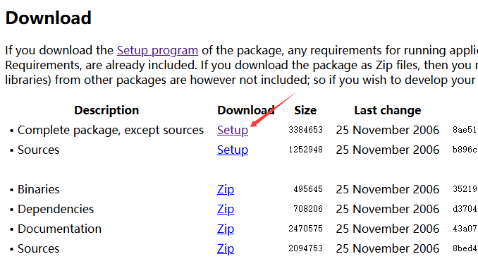
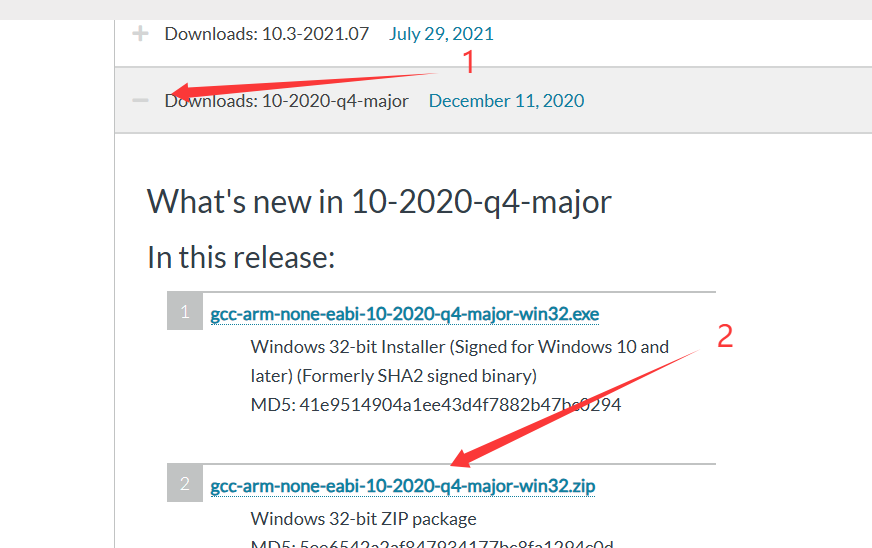
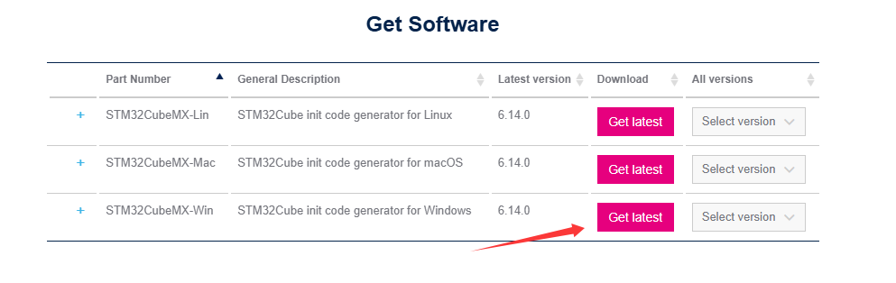
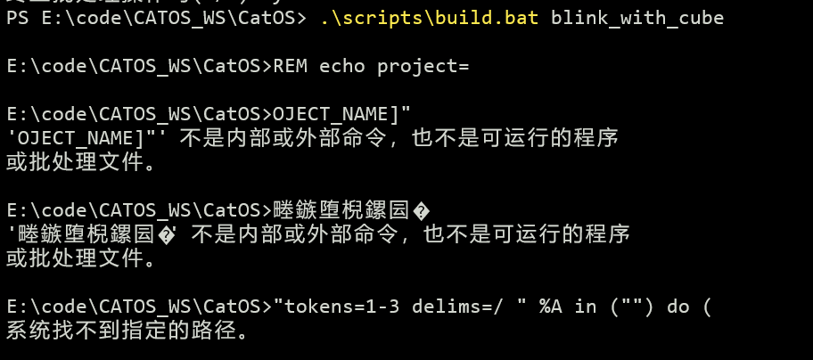
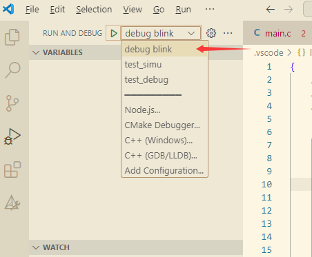
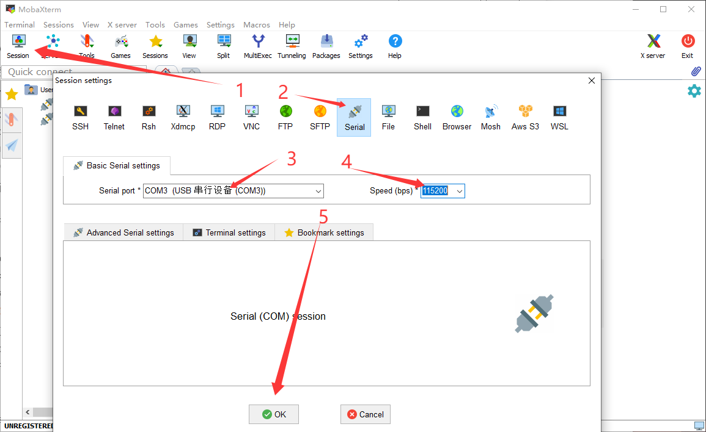

# BalanceCar

基于 CatOS 的平衡小车

<!-- PROJECT SHIELDS -->

[![Contributors][contributors-shield]][contributors-url]
[![Forks][forks-shield]][forks-url]
[![Stargazers][stars-shield]][stars-url]
[![Issues][issues-shield]][issues-url]
[![MIT License][license-shield]][license-url]

<!-- PROJECT LOGO -->
<br />

<p align="center">
  <a href="https://github.com/peach-1s-me/CatOS/">
    <a>powered by</a>
    
  </a>

  <p align="center">
    <a href="https://github.com/peach-1s-me/BalanceCar/tree/main/projects">查看Demo</a>
    ·
    <a href="https://github.com/peach-1s-me/BalanceCar/issues">报告Bug</a>
    ·
    <a href="https://github.com/peach-1s-me/BalanceCar/issues">提出新特性</a>
  </p>

</p>

## 目录
- [文件目录说明](#文件目录说明)
- [上手指南](#上手指南)
  - [开发前的配置要求](#开发前的配置要求)
  - [开发环境搭建](#开发环境搭建)
  - [克隆代码](#克隆代码)
  - [编译下载](#编译调试)
  - [附 使用 MobaXterm 调试串口](#附-使用-mobaxterm-调试串口)
- [开发的架构](#开发的架构)
- [部署](#部署)
- [使用到的框架](#使用到的框架)
- [贡献者](#贡献者)
  - [如何参与开源项目](#如何参与开源项目)
- [版本控制](#版本控制)
- [作者](#作者)
- [版权说明](#版权说明)
- [鸣谢](#鸣谢)

### 文件目录说明

```
catOS
├─.vscode                  vscode 项目配置文件
├─catos                    catos 项目目录
├─cmake                    cmake规则
├─doc                      文档
├─port                     移植包
├─projects                 项目目录
│  ├─car
│  │  ├─include
│  │  └─src
│  │      ├─cubemx_project
│  │      │  ├─App          应用相关
│  │      │  ├─Com          卡尔曼滤波和PID
│  │      │  ├─Core         CubeMX核心代码
│  │      │  ├─Drivers      CMSIS和HAL库
│  │      │  ├─Int          电机OLED屏幕
│  │      └─port_cortex_m3  cortex-m3架构相关
│  └─project_template  项目模板
├─README.assets        readme图片
└─scripts              编译调试用的脚本
```

### 上手指南

#### 开发前的配置要求

1. windows10及以上操作系统（linux还未测试cmake构建)

#### 开发环境搭建

| 软件                             | 优点                                   | 缺点                                                         |
| -------------------------------- | -------------------------------------- | ------------------------------------------------------------ |
| cmake + makefile + gcc + openocd | 配置好后可以结合vscode有较好的调试体验 | 安装和配置较为麻烦，但本文档有一点点教程                     |
| keilMDK                          | 老牌IDE，编译很快，调试功能全面        | 有点老，UI和体验较差，但也可以使用vscode编辑，keil仅作为编译调试工具 |

note：貌似[xPack Binary Development Tools](https://github.com/xpack-dev-tools)这里有 cmake，arm-none-eabi-gcc 和 openocd，感兴趣可以试试，本项目目前只用过他的 openocd。

1. ##### 安装cmake

跨平台的构建工具，解决了仅使用 makefile 时构建脚本不同系统或平台不能通用的问题。

下载地址[Download CMake](https://cmake.org/download/)，选择合适的版本，win10选择最新的 Windows x64 Installer 即可。安装时可以顺便勾选添加到环境变量 (不知道选哪个就选 for all users)。

2. ##### 安装makefile

传奇构建工具，每个 c 开发者都应该了解和使用过他。

下载地址[Make for Windows](https://gnuwin32.sourceforge.net/packages/make.htm) (linux发行版一般都自带了makefile)，选择 Complete package 下载并安装，完成安装后将安装路径下的bin目录添加到环境变量。



3. ##### 安装arm-none-eabi-gcc

ARM公司使用 gcc 定制的开源工具套件，用于32位 arm 处理器嵌入式软件开发。

下载地址[Downloads | GNU Arm Embedded Toolchain Downloads – Arm Developer](https://developer.arm.com/downloads/-/gnu-rm)，如果没有习惯使用的版本可以和作者一样用 10-2020-q4-major 版本，下载解压后加入环境变量即可使用（也可使用安装包）。



4. ##### 安装openocd

一个超牛超方便的开源片上调试软件，可以结合 gdb 等工具进行嵌入式软件下载和调试。

下载地址[Releases · xpack-dev-tools/openocd-xpack](https://github.com/xpack-dev-tools/openocd-xpack/releases)下载 darwin-x64 就行，这里用的 0.12.0-3，日常下载解压后加入环境变量。

5. ##### 安装stm32cubemx

ST公司为他们的 stm32 系列 mcu 推出的图形化配置工具，可以方便地对芯片进行初始化配置，并生成相应的代码，用户只需要考虑应用逻辑而无需过多纠结于初始化。

下载地址[STM32CubeMX - STM32Cube initialization code generator - STMicroelectronics](https://www.st.com/en/development-tools/stm32cubemx.html#st-get-software)，选择windows版本下载安装即可。



6. ##### 安装MobaXterm

一个很好用的远程终端工具，包含 ssh、vnc 等功能，这里主要使用的是串口终端，也可以使用 putty 等终端工具。

下载地址[MobaXterm Xserver with SSH, telnet, RDP, VNC and X11 - Download](https://mobaxterm.mobatek.net/download.html)，下载免费版即可。

#### 克隆代码

**注意**：由于在windows下执行bat脚本需要换行符格式为windows下的CRLF，而代码默认为unix和linux下的LF，因此克隆前最好设置git的换行符自动切换
```
git config --global core.autocrlf true
```
否则可能会出现以下状况


```sh
git clone https://github.com/peach-1s-me/BalanceCar.git
```

#### 编译调试


3.2 构建

在 scripts 目录下有多个批处理脚本，用于构建和调试：

| 脚本名        | 功能                      | 使用方法               |
| ------------- | ------------------------- | ---------------------- |
| build.bat     | 编译项目                  | build.bat [项目名]     |
| build_tests.bat| 编译项目(带测试部分)      | build_tests.bat [项目名]|
| clean.bat     | 在项目目录执行 make clean | clean.bat [项目名]     |
| clean_all.bat | 清理所有生成              | clean_all.bat          |
| flash.bat     | 烧写开发板                | flash.bat [项目名]     |
| gdb_start.bat | 启动gdb                   | gdb_start.bat [项目名] |
| ocd_start.bat | 启动openocd               | ocd_start.bat [项目名] |

**注意**：
1. 其中的 flash.bat 和 ocd_start.bat 要**根据自己的调试器进行配置**，使用openocd进行下载或调试的时候要指定两个配置文件 interface 和 target，分别描述使用的调试器和目标开发板，可选择的配置文件可以在 openocd 安装目录下的openocd/scripts/interface 和 openocd/scripts/target 中查看。

```bat
./scripts/build.bat car
```

2.2.6 烧写和调试

启动串口终端程序并打开串口(MobaXterm可以看后一节[使用 MobaXterm 调试串口](#_use_mobaxterm))

编译的可执行文件位于 output/car/car.elf

烧写到开发板，同时会对开发板进行 reset 操作：
```bat
./scripts/flash.bat car
```

如果需要调试，则先启动 openocd：

```bat
./scripts/ocd_start.bat
```

再用另一个控制台启动 gdb：
```bat
./scripts/gdb_start.bat
```

也可以使用 vscode 的调试支持使用 openocd，更方便，在 vscode 中下载 [Cortex-Debug](https://marketplace.visualstudio.com/items?itemName=marus25.cortex-debug) 插件并在 lunch.json中创建配置：
```json
"configurations": [
        {
            "cwd": "${workspaceRoot}",
            "executable": "${workspaceFolder}\\output\\blink\\blink.elf",
            "name": "debug blink",
            "request": "launch",
            "type": "cortex-debug",
            "servertype": "openocd",
            "interface": "swd",
            "device": "stm32f1x",
            "configFiles": [
                "interface/cmsis-dap.cfg",
                "target/stm32f1x.cfg"
            ],
            "searchDir": [],
            "runToEntryPoint": "main",
            "showDevDebugOutput": "none",
            "postLaunchCommands": [
                "monitor reset init"
            ]
        },
```

然后在 debug 视图下选择相应的调试配置即可



##### 附 使用 MobaXterm 调试串口<a id="_use_mobaxterm"></a>

启动 MobaXterm 后点击 Session->Serial，选择对应的串口号和比特率



### 开发的架构 

暂无

### 部署

暂无

### 使用到的框架

暂无

### 贡献者

暂无

#### 如何参与开源项目

贡献使开源社区成为一个学习、激励和创造的绝佳场所。你所作的任何贡献都是**非常感谢**的。


1. Fork the Project
2. Create your Feature Branch (`git checkout -b feature/AmazingFeature`)
3. Commit your Changes (`git commit -m 'Add some AmazingFeature'`)
4. Push to the Branch (`git push origin feature/AmazingFeature`)
5. Open a Pull Request


### 版本控制

该项目使用Git进行版本管理。您可以在repository参看当前可用版本。

### 作者

JiayuanWen (github: peach-1s-me)

qq:648137125  

 *您也可以在贡献者名单中参看所有参与该项目的开发者。*

### 版权说明

该项目签署了 Apache 授权许可，详情请参阅 [LICENSE](https://github.com/peach-1s-me/BalanceCar/blob/main/LICENSE)

### 鸣谢


- [Img Shields](https://shields.io)
- [GitHub Pages](https://pages.github.com)
- [Cortex-Debug](https://github.com/Marus/cortex-debug)
- [Best-README-Template](https://github.com/othneildrew/Best-README-Template)
- [xpack-dev-tools/openocd-xpack: A binary distribution of OpenOCD](https://github.com/xpack-dev-tools/openocd-xpack)

<!-- links -->

[your-project-path]:peach-1s-me/BalanceCar
[contributors-shield]: https://img.shields.io/github/contributors/peach-1s-me/BalanceCar.svg?style=flat-square
[contributors-url]: https://github.com/peach-1s-me/BalanceCar/graphs/contributors
[forks-shield]: https://img.shields.io/github/forks/peach-1s-me/BalanceCar.svg?style=flat-square
[forks-url]: https://github.com/peach-1s-me/BalanceCar/network/members
[stars-shield]: https://img.shields.io/github/stars/peach-1s-me/BalanceCar.svg?style=flat-square
[stars-url]: https://github.com/peach-1s-me/BalanceCar/stargazers
[issues-shield]: https://img.shields.io/github/issues/peach-1s-me/BalanceCar.svg?style=flat-square
[issues-url]: https://img.shields.io/github/issues/peach-1s-me/BalanceCar.svg
[license-shield]: https://img.shields.io/github/license/peach-1s-me/BalanceCar.svg?style=flat-square
[license-url]: https://github.com/peach-1s-me/BalanceCar/blob/main/LICENSE
